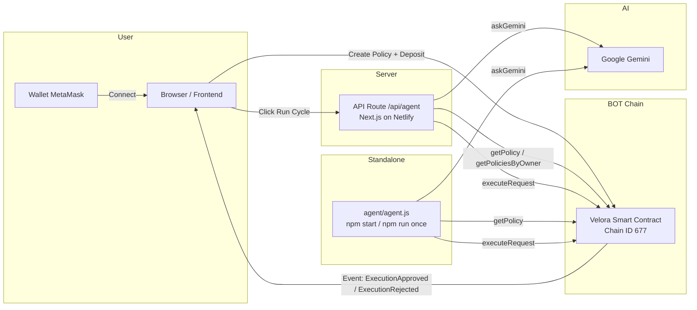
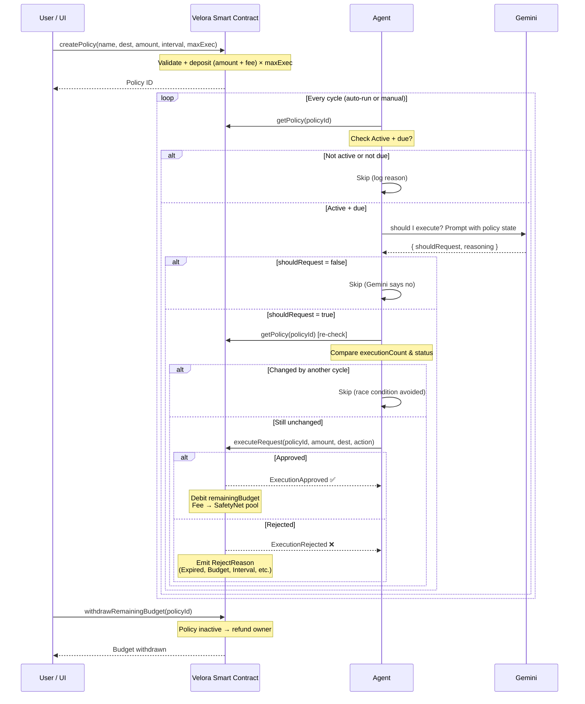
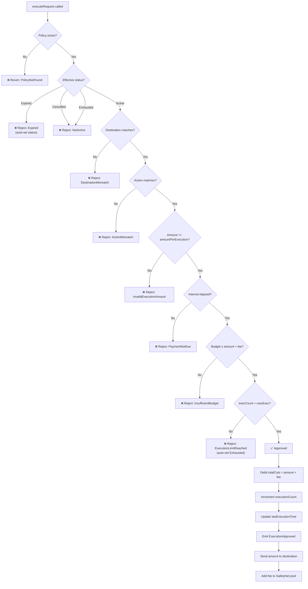

<p align="center">
  
</p>

<h1 align="center">Velora</h1>

<p align="center"><b>Delegate tasks, not your wallet.</b></p>

<p align="center">Trust-minimized AI agent execution on BOT Chain — create on-chain policies, deploy autonomous agents, and stay in full control.</p>

<p align="center">Built for the <b>BOTChain Build Week</b> Hackathon</p>

---

## 📌 Table of Contents

- [The Problem](#-the-problem)
- [The Solution](#-the-solution)
- [System Architecture](#-system-architecture)
- [Policy Execution Flow](#-policy-execution-flow)
- [Contract Decision Tree](#-contract-decision-tree)
- [Core Features](#-core-features)
- [Live Deployment](#-live-deployment)
- [Repository Structure](#-repository-structure)
- [Getting Started (User)](#-getting-started-user)
- [End-to-End Try-It Guide](#-end-to-end-try-it-guide)
- [Getting Started (Developer)](#-getting-started-developer)
- [Smart Contract](#-smart-contract)
- [Security](#-security)
- [Team](#-team)
- [References](#-references)

---

## ❌ The Problem

AI agents can reason and act, but they cannot be fully trusted. Current approaches force a dangerous choice:

| Approach | Risk |
|---|---|
| Give agent full wallet access | One mistake = catastrophic loss |
| Give agent no access | Agent cannot execute anything useful |
| Use API keys + proxy | Server compromise leaks credentials |

There is no middle ground between **utility** and **security** for autonomous AI agents.

---

## ✅ The Solution

Velora introduces **on-chain policy enforcement**. You define granular, immutable rules in a Solidity smart contract — budget, destination, amount, timing, execution limits. The AI agent can only *propose* actions; the smart contract is the sole authority that approves or rejects every request.

**You no longer trust the AI. You trust the code.**

### Key principles

- **AI-powered agent** — uses Google Gemini for execution decisions
- **Server-side agent** — a small API route hosts the agent's gas wallet and Gemini key; your personal wallet is never touched by the server
- **Gross-up fee** — SafetyNet fee (1%) included in pre-funded deposit, agent never needs `msg.value`
- **Policy SafetyNet** — on-chain insurance pool, policy owners can claim compensation

---

## 🏛️ System Architecture



---

## 🔄 Policy Execution Flow



---

## 🌲 Contract Decision Tree (`executeRequest`)



---

## 🧩 Core Features

| Layer | Feature | Status |
|---|---|---|
| **Policy Creation** | Multi-step wizard (name, destination, action, limits, review) | ✅ Live |
| **On-Chain Rules** | 7 immutable reject reasons enforced by contract | ✅ Live |
| **Frontend Simulation** | Animated rule timeline + real `executeRequest` transaction | ✅ Live |
| **Autonomous Agent** | AI-powered (Gemini), runs via UI click or standalone script | ✅ Live |
| **Gross-up Fee** | 1% SafetyNet fee included in pre-funded deposit, no `msg.value` | ✅ Live |
| **SafetyNet Pool** | On-chain insurance — claim up to 70% of policy's contributions | ✅ Live |
| **Race Protection** | Re-check on-chain before submit — prevents double-execution | ✅ Live |
| **Demo Mode** | Toggle seconds instead of days for rapid testing | ✅ Live |
| **Contract Verification** | Source code verified on BOTScan | ✅ Live |

---

## 🌐 Live Deployment

| Asset | Link |
|---|---|
| **Web App** | https://velora-policies.my.id (alias: `velora-policies.netlify.app`) |
| **Chain** | BOT Chain Mainnet (Chain ID 677) |
| **Contract** | `0xcaE9f3569486094b86Fc8b85024050B58815ddFe` — [View on BOTScan](https://scan.botchain.ai/address/0xcaE9f3569486094b86Fc8b85024050B58815ddFe) |
| **Repository** | https://github.com/bayuapriansyah/velora |
| **X Post** | TBD — replace with your post URL |

---

## 📂 Repository Structure

```
velora/
├── app/
│   ├── api/agent/           # POST /api/agent — AI agent execution cycle
│   │                        # GET  /api/agent/status — agent wallet + gas balance
│   ├── create-policy/        # Multi-step policy creation wizard (4 steps)
│   ├── dashboard/            # Policy table, SafetyNet stats, analytics
│   ├── simulation/           # Rule simulation + live on-chain execution
│   ├── agent/                # Agent control panel (Run Cycle, logs, auto-run)
│   └── policies/             # Full policy list + cancel/withdraw
├── components/               # UI grouped by page + Radix primitives
├── contracts/
│   ├── Velora.sol            # Solidity smart contract (source)
│   ├── Velora.abi.json       # Hand-maintained ABI for frontend
│   └── addresses.ts          # Contract address per chain ID
├── hooks/                    # useWallet, useVeloraContract, usePolicies, usePolicyEvents
├── lib/                      # ethers.ts, network.ts, format.ts, velora-address.ts
├── types/                    # policy.ts (enums mirroring Solidity)
├── utils/                    # validation.ts — client-side prediction mirroring contract logic
├── netlify.toml              # Netlify deploy config (Next.js plugin)
└── agent/                    # Standalone agent script (agent.js) + env
```

---

## 🚀 Getting Started (User)

1. Open the Velora web app
2. Connect MetaMask — switch to BOT Chain Mainnet
3. Click **Create Policy** → fill in name, destination, amount, interval, max executions
4. Review + sign the transaction (one gas fee)
5. Open **Dashboard** → click **Fund gas** on the agent wallet card (~`0.006 BOT` per execution) so the agent can pay transaction fees
6. Navigate to **Agent** → click **Run Cycle**
7. Watch the agent evaluate policies, ask Gemini, and submit execution requests
8. Check **Dashboard** for remaining budget, execution count, and SafetyNet stats

> **Optional:** point the app at a different Velora deployment via **Settings → Contract** in the sidebar.

---

## 🧪 End-to-End Try-It Guide

This guide walks you through the **full Velora flow** — from an empty wallet to a live on-chain policy executing autonomously. Every transaction below is real: nothing here is mocked.

### What you'll need

| Item | Details |
|---|---|
| MetaMask | With **BOT Chain Mainnet** added (chain ID `677`, RPC `https://rpc.botchain.ai`, symbol `BOT`) |
| BOT balance | A small amount for gas + deposit (~`0.02 BOT` is comfortable for this guide) |
| Web app | https://velora-policies.my.id |
| Contract | Default `0xcaE9f3569486094b86Fc8b85024050B58815ddFe` (changeable via **Settings → Contract**) |

### Step 1 — Create a policy

1. Open the web app and connect MetaMask (make sure the network is BOT Chain).
2. Go to **Create Policy** and fill in:
   - **Name** — anything, e.g. `Auto-test`
   - **Destination** — your own wallet address (so the payout comes back to you)
   - **Action** — `Transfer`
   - **Amount per execution** — `0.001 BOT`
   - **Max executions** — `1`
   - **Interval** — `10s`
3. Review. Deposit = `(amount + 1% fee) × max executions` ≈ `0.00101 BOT`.
4. Sign the transaction. The policy becomes **Active** on-chain.

> ℹ️ The UI auto-calculates the minimum required deposit. If you ever see a `BudgetTooSmall` revert, raise the deposit to the value shown.

### Step 2 — Fund the agent's gas wallet

The agent has its **own wallet** that only pays transaction gas. Executions are paid from the policy budget, but the agent needs BOT to submit them.

1. Open **Dashboard** → find the **Agent wallet** card.
2. Click **Fund gas** and send a little BOT (e.g. `0.01 BOT`).
3. Each execution needs ~`0.006 BOT` in gas, so `0.01` covers one run with buffer.

### Step 3 — Run a cycle (manual)

1. Go to the **Agent** page (`/agent`).
2. Click **Run Cycle**.
3. Watch the log panel:
   - The agent reads your Active policy and checks if it is due.
   - Gemini answers `{ shouldRequest: true/false, reasoning }`.
   - On approval the contract fires **`ExecutionApproved`** → your destination receives `0.001 BOT`.
   - On rejection you'll see a machine-readable reason (e.g. `DestinationMismatch`, `InsufficientBudget`).

### Step 4 — Run automatically from the UI (optional)

Want the agent to keep evaluating without clicking every time? Use the built-in **Auto Run** toggle on the Agent page — no separate service needed:

1. Go to the **Agent** page (`/agent`).
2. Turn on **Auto Run** and choose an interval (default `60s`).
3. Leave the tab open — while it is open, a cycle runs every interval: it reads your policies, asks Gemini, and submits any due executions.
4. Create an **Active** policy — the next cycle automatically requests execution and shows `✅ APPROVED`.

> ℹ️ **Auto Run runs from the browser tab**, so the page must stay open. It calls the same `/api/agent` endpoint as the **Run Cycle** button — nothing extra to deploy.

### Step 5 — Verify

- **Dashboard** → remaining budget, execution count, and policy status (`Exhausted` once max executions is reached).
- **Destination wallet** → received the payout amount.
- **BOTScan** → [contract activity](https://scan.botchain.ai/address/0xcaE9f3569486094b86Fc8b85024050B58815ddFe) shows `ExecutionApproved` events.

### Step 6 — Clean up

- **Cancel policy** → stops future executions.
- **Withdraw remaining budget** → returns the leftover deposit to your wallet.

### Troubleshooting

| Symptom | Fix |
|---|---|
| `insufficient funds` on execution | Agent wallet ran out of gas — top it up via **Fund gas** |
| Execution **Rejected** | Read the reject reason on the Agent page; it mirrors a policy rule (destination, action, amount, interval, max executions, budget) |
| `BudgetTooSmall` at create | Deposit too low — use the deposit value shown in the review step |
| Gemini "shouldRequest: false" | Expected — Gemini is advisory. The contract remains the final authority |

---

## 🚀 Getting Started (Developer)

### Prerequisites
- Node.js ≥ 18
- MetaMask with BOT Chain Mainnet added

### Local setup

```bash
git clone https://github.com/your-org/velora.git
cd velora
npm install
cp agent/.env.example agent/.env
# fill in: RPC_URL=https://rpc.botchain.ai, AGENT_PRIVATE_KEY, GEMINI_API_KEY
# CONTRACT_ADDRESS is optional — falls back to the deployed 0xcaE9…ddFe, or users
# can set their own via Settings → Contract in the UI.
npm run dev
```

Open `http://localhost:3000`.

### Commands

| Command | Action |
|---|---|
| `npm run dev` | Start dev server on :3000 |
| `npm run build` | Production build |
| `npm run lint` | ESLint via next lint |

### Standalone agent

```bash
cd agent
npm install
# .env already configured
npm run once      # single decision cycle
npm start         # loop forever
```

---

## 🔐 Smart Contract

`Velora.sol` — deployed on BOT Chain Mainnet. Verified on BOTScan.

### Constructor parameters

| Parameter | Value | Description |
|---|---|---|
| `_safetyNetFeeBps` | `100` (1%) | Fee per execution added to SafetyNet pool |
| `_minFeeThreshold` | `100000000000000` (0.0001 BOT) | Minimum amount for fee to apply |
| `_claimCooldown` | `30` (30 seconds) | Cooldown between claims |
| `_maxClaimPerTx` | `10000000000000000` (0.01 BOT) | Max amount per claim transaction |

### Public functions

| Function | Description |
|---|---|
| `createPolicy` | Create policy + deposit budget (payable) |
| `executeRequest` | Execute or reject based on policy rules |
| `cancelPolicy` | Cancel policy (owner only) |
| `withdrawRemainingBudget` | Withdraw remaining budget (inactive policies) |
| `seedSafetyNet` | Anyone can seed the pool (payable) |
| `claimFromSafetyNet` | Claim compensation from pool (owner only) |

### Custom errors

All revert reasons use Solidity custom errors for gas efficiency:
`PolicyNotFound`, `NotPolicyOwner`, `ZeroDeposit`, `InvalidExpiration`, `InvalidDestination`, `InvalidMaxExecutions`, `InvalidAmountPerExecution`, `InvalidPaymentInterval`, `BudgetTooSmall`, `PolicyNotActive`, `NothingToWithdraw`, `WithdrawTransferFailed`, `ReentrantCall`

---

## 🛡 Security

- **Checks-Effects-Interactions** pattern on all fund-transferring functions
- **Reentrancy protection** (`nonReentrant`) on `executeRequest`, `claimFromSafetyNet`, and `withdrawRemainingBudget`
- **Custom errors** instead of `require` strings — lower gas, consistent pattern
- **7 on-chain reject reasons** with machine-readable events — no silent failures
- **Pre-flight re-check** — agent re-fetches policy state before submitting to avoid race conditions
- **Gross-up fee** — agent never sends `msg.value`, reducing attack surface
- **No admin key** — contract has no owner, no upgrade mechanism, no backdoor
- **Server secrets, scoped** — the server only holds the agent's gas wallet key + Gemini key; your personal wallet never leaves your browser

---

## 👥 Team

Built for the **BOTChain Build Week** Hackathon by:

- **Velora** — Full-stack developer

---

## 📚 References

- [BOT Chain Developer Docs](https://dev-docs.botchain.ai)
- [BOTScan Explorer](https://scan.botchain.ai)
- [BOT Chain Faucet](https://faucet.botchain.ai/basic)
- [Remix IDE](https://remix.ethereum.org)
- [Next.js Documentation](https://nextjs.org/docs)
- [ethers.js v6](https://docs.ethers.org)
- [Google AI Studio (Gemini)](https://aistudio.google.com/app/apikey)

---

## 📄 License

MIT

---

*Velora · Built for BOTChain Build Week · Delegate tasks, not your wallet.*
